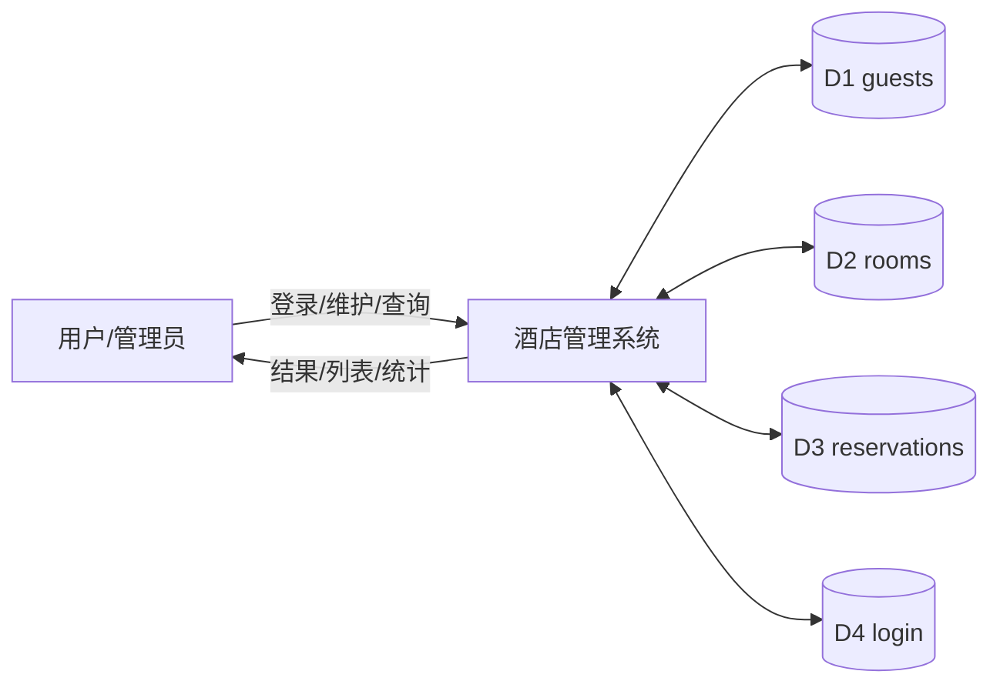
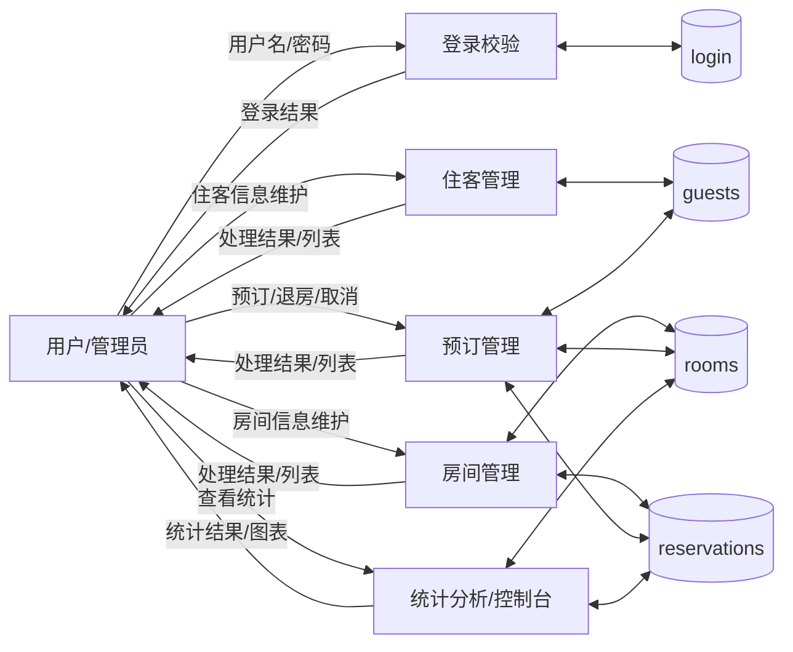
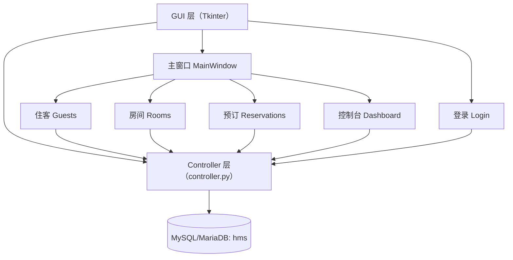
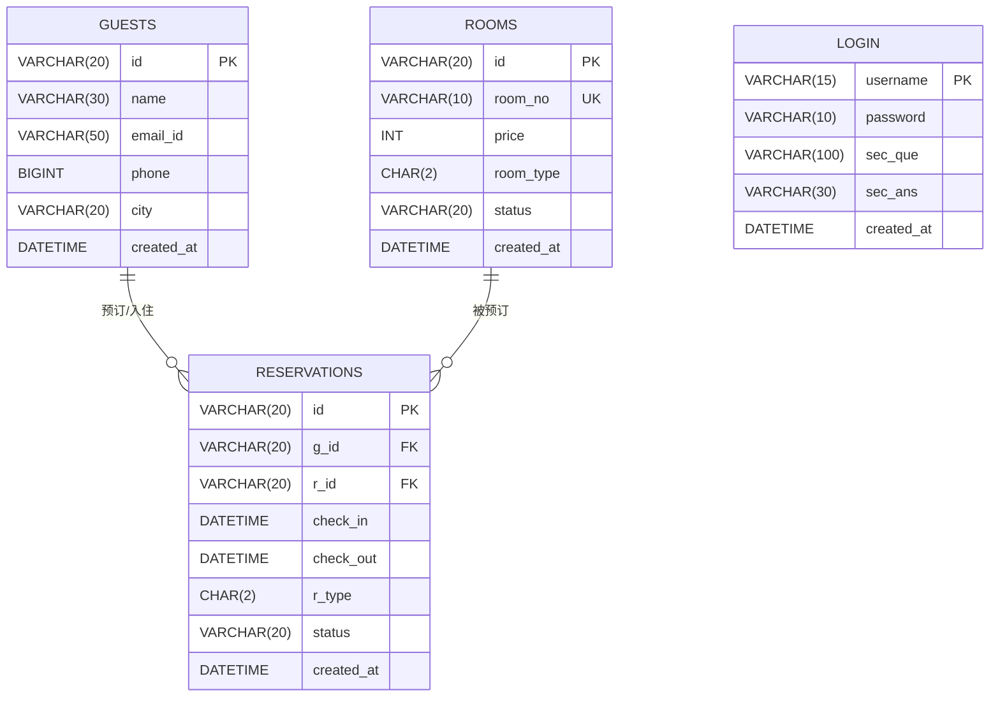

# 数据库系统课程设计报告：酒店管理系统（HMS）

> 工程目录：`d:\CODE\hotel`  
> 初始化脚本：`sql/hms.sql`  
> 核心代码：`controller.py`、`gui/**`  
> DBMS：MySQL / MariaDB（默认 `localhost:3306`，库名 `hms`：`config.py:3-7`）

---

## 封面（按模板填写）

| 项目 | 内容（请填写/可改） |
|---|---|
| 学年 | 2025~2026 |
| 学院 | 广东工业大学计算机学院 |
| 课程 | 数据库系统课程设计 |
| 题目 | 酒店管理系统（HMS） |
| 班级 |  |
| 姓名 |  |
| 学号 |  |
| 指导教师 |  |
| 完成日期 |  |

---

## 摘要

本课程设计面向酒店日常管理业务，完成了一个基于 MySQL/MariaDB 的酒店管理系统数据库与应用实现。系统围绕住客（`guests`）、房间（`rooms`）、预订（`reservations`）与登录（`login`）四类核心数据建立关系模型，使用主键与外键约束保证实体与参照完整性，并结合应用层校验实现房间状态、预订状态、唯一性与格式等用户自定义完整性。应用采用 Python + Tkinter 的 C/S 形态完成登录、控制台统计、住客管理、房间管理、预订管理等功能，覆盖数据库数据的增删改查与统计分析，并给出索引设计、备份恢复与最小权限账号方案，形成完整的数据库设计与实施文档。

**关键词**：酒店管理；MySQL；E-R 模型；规范化；完整性；权限控制

---

## 目录（Word 中自动生成）

> 建议将本文档复制到 Word 模板后，用“引用 → 目录”自动生成目录。

---

## 0. 任务书要求对照（快速定位）

| 任务书/模板要求 | 本文对应位置 |
|---|---|
| 封面、摘要、目录 | 本文“封面/摘要/目录” |
| 引言（绪论） | 第 1 节 |
| 相关技术介绍 | 第 2 节 |
| 需求分析 + 数据字典 + 数据流图（DFD） | 第 3 节 |
| 概念结构设计（E-R 图） | `4.3`（含实体、联系、基数） |
| 逻辑结构设计（关系模式、优化分析、用户子模式） | `4.4`、`4.5`、`4.4.1` |
| 完整性与安全性设计 | `4.6` |
| 物理结构设计（索引/存储/配置） | `4.7.1`、`4.7.3` |
| 数据库实施（建库脚本、备份恢复） | `4.1`、`4.7.2`、第 7 节 |
| 程序设计与实现（模块图、模块功能/IPO、CRUD） | 第 5 节（含 `5.1/5.2/5.3`） |
| 特殊查询（JOIN/LIKE/GROUP BY/子查询/视图） | `5.4` |
| 系统测试方案（可选） | 第 6 节 |
| 安装与使用说明 | 第 7 节 |
| 参考文献、致谢 | 文末 |

---

## 1. 引言（绪论）

酒店前台与管理人员通常需要完成住客信息登记、房间信息维护、预订创建/修改/取消、入住/退房处理以及经营统计等工作。若依赖纸质记录或零散表格，容易出现信息重复、数据不一致、统计滞后等问题。本课程设计以酒店管理业务为背景，给出从需求分析、数据库设计（概念/逻辑/物理）、数据库实施到应用系统实现的完整过程。

本项目采用本机部署 MySQL/MariaDB 完成数据库实现（任务书允许 DBMS 不限，推荐 openGauss：`数据库课程设计任务书.doc`），并以 Python 图形界面实现 CRUD 与统计查询，满足“基本表 ≥3、功能完整、包含特殊查询”等课程要求（`数据库课程设计任务书.doc`, `数据库课程设计封面与格式模板2025-2026.doc`）。

---

## 2. 相关技术介绍

### 2.1 DBMS 与 SQL 方言

- **MySQL/MariaDB**：支持 InnoDB 事务与外键约束；本项目建表均为 `ENGINE=InnoDB`（例如 `sql/hms.sql:37`, `sql/hms.sql:94`, `sql/hms.sql:129`）。
- 字符集：`utf8mb4`（建库与建表默认：`sql/hms.sql:23`, `sql/hms.sql:37`），适配中文与多语言。

### 2.2 应用开发技术栈（C/S）

- **Python 3 + Tkinter**：入口 `main.py:1-15`，启动登录窗口后进入主界面。
- **mysql-connector-python**：数据库驱动（`requirements.txt:1`；连接代码 `controller.py:1-38`）。
- **python-dotenv**：从 `.env` 加载数据库账号密码（`requirements.txt:4`；`controller.py:11-23`）。
- **matplotlib/numpy**：用于控制台图表展示（`requirements.txt:2-3`；Dashboard 使用见 `gui/main_window/dashboard/gui.py:377-400`）。

---

## 3. 需求分析

### 3.1 功能需求（面向用户）

- 登录：管理员通过用户名/密码进入系统（`gui/login/gui.py:23-29`）。
- 控制台：显示空房数、已预订数、酒店总价值、入住人数与图表（`gui/main_window/dashboard/gui.py:59-97`, `gui/main_window/dashboard/gui.py:172-217`, `gui/main_window/dashboard/gui.py:377-386`）。
- 住客管理：新增、查看、编辑、删除住客信息（`gui/main_window/guests/main.py:31-37`）。
- 房间管理：新增、查看、编辑、删除房间信息；房间状态随预订变化自动同步（`gui/main_window/rooms/main.py:32-38`；同步逻辑 `controller.py:252-285`, `controller.py:491-516`）。
- 预订管理：新增、查看、编辑、取消、删除预订；支持退房（checkout）处理（`gui/main_window/reservations/main.py:32-55`；退房 `gui/main_window/reservations/view_reservations/main.py:243`）。

### 3.2 非功能需求（可写入报告）

- 易用性：GUI 菜单清晰（控制台/房间/住客/预订），支持列表刷新与基本筛选。
- 一致性：依赖外键与应用层校验，避免孤儿预订；通过状态推导逻辑尽量保证显示一致。
- 安全性：通过 `.env` 读取数据库凭据（`controller.py:11-23`）；建议使用最小权限账号（见“数据库完整性与安全性设计总结”）。

### 3.3 数据字典（需求层：数据项 / 数据结构 / 数据流 / 数据存储 / 数据处理）

> 说明：本节给出“需求分析阶段的数据字典（DFD 配套）”。数据库字段级数据字典见 4.2。

**数据存储（Data Store）**

| 编号 | 名称 | 对应数据库表 | 说明 | 证据 |
|---|---|---|---|---|
| D1 | 住客库 | `guests` | 存储住客基本信息 | `sql/hms.sql:28-37` |
| D2 | 房间库 | `rooms` | 存储房间信息与状态 | `sql/hms.sql:84-94` |
| D3 | 预订库 | `reservations` | 存储预订信息（关联住客与房间） | `sql/hms.sql:114-129` |
| D4 | 登录库 | `login` | 存储系统登录账号 | `sql/hms.sql:57-64` |

**主要数据流（Data Flow）**

| 编号 | 数据流 | 来源 | 去向 | 数据结构（关键字段） | 证据 |
|---|---|---|---|---|---|
| F1 | 登录请求 | 用户 | 登录模块 | `{username, password}` | `gui/login/gui.py:23-29`, `controller.py:105-110` |
| F2 | 住客新增 | 用户 | 住客管理 | `{name, address, email_id, phone}` | `gui/main_window/guests/add_guests/gui.py:261`, `controller.py:210-225` |
| F3 | 房间新增 | 用户 | 房间管理 | `{room_no, price, room_type}` | `gui/main_window/rooms/add_room/gui.py:231`, `controller.py:228-247` |
| F4 | 预订新增 | 用户 | 预订管理 | `{g_id, r_id, check_in, check_out}` | `gui/main_window/reservations/add_reservations/gui.py:230`, `controller.py:309-366` |
| F5 | 退房处理 | 用户 | 预订管理 | `{reservation_id}` | `gui/main_window/reservations/view_reservations/main.py:243`, `controller.py:157-180` |

**数据处理（Process）**

| 编号 | 处理过程 | 输入 | 输出 | 说明 | 证据 |
|---|---|---|---|---|---|
| P1 | 登录校验 | F1 | 登录结果 | 校验 `login` 表账号密码 | `controller.py:105-110` |
| P2 | 住客维护 | F2 | 住客列表/结果 | 对 `guests` 增删改查 | `controller.py:200-226`, `controller.py:459-467`, `controller.py:427-433` |
| P3 | 房间维护 | F3 | 房间列表/结果 | 对 `rooms` 增删改查；同步状态 | `controller.py:228-247`, `controller.py:438-456`, `controller.py:419-425`, `controller.py:252-285` |
| P4 | 预订维护 | F4/F5 | 预订列表/结果 | 对 `reservations` 增删改查；退房 | `controller.py:309-366`, `controller.py:540-577`, `controller.py:411-417`, `controller.py:157-180` |

### 3.4 数据流图（DFD，文本化表示）

> 说明：报告中可用绘图工具重画；此处给出可直接复制的 Mermaid 版本。

**DFD-0（上下文图）**



**DFD-1（功能分解）**



---

## 4. 数据库设计与实施

### 4.1 数据库初始化脚本定位

- 仅发现 1 个初始化脚本：`sql/hms.sql:1`（包含建库、建表、约束与示例数据插入）

---

### 4.2 数据字典（表 / 字段 / 类型 / 约束 / 默认值）

#### 4.2.1 `guests`

- 表定义来源：`sql/hms.sql:28`

| 字段 | 类型 | 可空 | 默认值 | 约束 | 来源 |
|---|---|---:|---|---|---|
| `id` | `varchar(20) CHARACTER SET ascii COLLATE ascii_bin` | 否 | 无 | PK | `sql/hms.sql:29`, `sql/hms.sql:36` |
| `name` | `varchar(30)` | 是 | `NULL` |  | `sql/hms.sql:30` |
| `address` | `varchar(50)` | 是 | `NULL` |  | `sql/hms.sql:31` |
| `email_id` | `varchar(50)` | 是 | `NULL` |  | `sql/hms.sql:32` |
| `phone` | `bigint(20)` | 是 | `NULL` |  | `sql/hms.sql:33` |
| `city` | `varchar(20)` | 是 | `NULL` |  | `sql/hms.sql:34` |
| `created_at` | `datetime` | 是 | `current_timestamp()` |  | `sql/hms.sql:35` |

---

#### 4.2.2 `login`

- 表定义来源：`sql/hms.sql:57`

| 字段 | 类型 | 可空 | 默认值 | 约束 | 来源 |
|---|---|---:|---|---|---|
| `username` | `varchar(15)` | 否 | 无 | PK | `sql/hms.sql:58`, `sql/hms.sql:63` |
| `password` | `varchar(10)` | 否 | 无 |  | `sql/hms.sql:59` |
| `sec_que` | `varchar(100)` | 是 | `NULL` |  | `sql/hms.sql:60` |
| `sec_ans` | `varchar(30)` | 是 | `NULL` |  | `sql/hms.sql:61` |
| `created_at` | `datetime` | 是 | `current_timestamp()` |  | `sql/hms.sql:62` |

---

#### 4.2.3 `rooms`

- 表定义来源：`sql/hms.sql:84`

| 字段 | 类型 | 可空 | 默认值 | 约束 | 来源 |
|---|---|---:|---|---|---|
| `id` | `varchar(20) CHARACTER SET ascii COLLATE ascii_bin` | 否 | 无 | PK | `sql/hms.sql:85`, `sql/hms.sql:92` |
| `room_no` | `varchar(10)` | 是 | `NULL` | UNIQUE(`room_no`) | `sql/hms.sql:86`, `sql/hms.sql:93` |
| `price` | `int(11)` | 是 | `NULL` |  | `sql/hms.sql:87` |
| `room_type` | `char(2)` | 是 | `NULL` |  | `sql/hms.sql:88` |
| `currently_booked` | `tinyint(1)` | 是 | `0` |  | `sql/hms.sql:89` |
| `status` | `varchar(20)` | 是 | `NULL` |  | `sql/hms.sql:90` |
| `created_at` | `datetime` | 是 | `current_timestamp()` |  | `sql/hms.sql:91` |

---

#### 4.2.4 `reservations`

- 表定义来源：`sql/hms.sql:114`

| 字段 | 类型 | 可空 | 默认值 | 约束 | 来源 |
|---|---|---:|---|---|---|
| `id` | `varchar(20) CHARACTER SET ascii COLLATE ascii_bin` | 否 | 无 | PK | `sql/hms.sql:115`, `sql/hms.sql:124` |
| `g_id` | `varchar(20) CHARACTER SET ascii COLLATE ascii_bin` | 否 | 无 | FK→`guests(id)`，`ON DELETE CASCADE` | `sql/hms.sql:116`, `sql/hms.sql:127` |
| `r_date` | `datetime` | 是 | `NULL` |  | `sql/hms.sql:117` |
| `check_in` | `datetime` | 否 | 无 |  | `sql/hms.sql:118` |
| `check_out` | `datetime` | 是 | `NULL` |  | `sql/hms.sql:119` |
| `r_id` | `varchar(20) CHARACTER SET ascii COLLATE ascii_bin` | 否 | 无 | FK→`rooms(id)`，`ON DELETE CASCADE` | `sql/hms.sql:120`, `sql/hms.sql:128` |
| `r_type` | `char(2)` | 是 | `NULL` |  | `sql/hms.sql:121` |
| `status` | `varchar(20)` | 是 | `NULL` |  | `sql/hms.sql:122` |
| `created_at` | `datetime` | 是 | `current_timestamp()` |  | `sql/hms.sql:123` |
| 索引 |  |  |  | `KEY(FK_guests:g_id)`, `KEY(FK_rooms:r_id)` | `sql/hms.sql:125`, `sql/hms.sql:126` |

---

### 4.3 概念结构设计（ER：实体 / 属性 / 联系 / 基数）

#### 4.3.1 实体与属性（含主键）

- **Guest**：{`id`, `name`, `address`, `email_id`, `phone`, `city`, `created_at`}；PK=`id`  
  来源：`sql/hms.sql:28`, `sql/hms.sql:36`
- **Room**：{`id`, `room_no`, `price`, `room_type`, `currently_booked`, `status`, `created_at`}；PK=`id`；UQ(`room_no`)  
  来源：`sql/hms.sql:84`, `sql/hms.sql:92`, `sql/hms.sql:93`
- **Reservation**：{`id`, `g_id`, `r_id`, `r_date`, `check_in`, `check_out`, `r_type`, `status`, `created_at`}；PK=`id`  
  来源：`sql/hms.sql:114`, `sql/hms.sql:124`
- **Login**：{`username`, `password`, `sec_que`, `sec_ans`, `created_at`}；PK=`username`  
  来源：`sql/hms.sql:57`, `sql/hms.sql:63`

#### 4.3.2 联系与基数（显式外键）

- **Guest — Reservation**：`reservations.g_id` → `guests.id`（`ON DELETE CASCADE`）  
  基数：`Guest 1 : N Reservation`；且 `g_id` 为 `NOT NULL`（`sql/hms.sql:116`），因此 Reservation→Guest 为 **1..1（必选）**  
  来源：`sql/hms.sql:116`, `sql/hms.sql:127`

- **Room — Reservation**：`reservations.r_id` → `rooms.id`（`ON DELETE CASCADE`）  
  基数：`Room 1 : N Reservation`；且 `r_id` 为 `NOT NULL`（`sql/hms.sql:120`），因此 Reservation→Room 为 **1..1（必选）**  
  来源：`sql/hms.sql:120`, `sql/hms.sql:128`

- **Guest 与 Room 的 N:M（通过 Reservation 关联）**  
  说明：Reservation 同时持有 `g_id` 与 `r_id` 外键，因此 Guest 与 Room 通过 Reservation 形成多对多关系（带时间属性等）。  
  来源：`sql/hms.sql:116`, `sql/hms.sql:120`, `sql/hms.sql:127`, `sql/hms.sql:128`

#### 4.3.3 推断关系（非外键，但由代码逻辑暗示）

> 说明：以下属于“推断关系”，并非 SQL 中的显式外键/约束。

- **推断：`guests.name` 被当作查询键使用（但表结构未保证唯一）**  
  证据：`controller.py:194-198`（`select id from guests where name = %s;`；同名时返回 `None`，避免误匹配）  
  相关字段定义：`sql/hms.sql:30`

- **推断：`rooms.status`/`rooms.currently_booked` 可能是从 `reservations` 推导的派生状态（存在冗余风险）**  
  证据：从 `reservations` 计算房间状态用于展示（查询计算，不回写 `rooms.status`）：`controller.py:292-313`, `controller.py:501-512`  
  相关字段定义：`sql/hms.sql:89-90`

---

### 4.4 逻辑结构设计（关系模式 R(属性...)）与 PK/FK

- `GUESTS(id, name, address, email_id, phone, city, created_at)`  
  PK：`id`  
  来源：`sql/hms.sql:36`

- `LOGIN(username, password, sec_que, sec_ans, created_at)`  
  PK：`username`  
  来源：`sql/hms.sql:63`

- `ROOMS(id, room_no, price, room_type, currently_booked, status, created_at)`  
  PK：`id`；UQ：`room_no`  
  来源：`sql/hms.sql:92-93`

- `RESERVATIONS(id, g_id, r_date, check_in, check_out, r_id, r_type, status, created_at)`  
  PK：`id`；FK：`g_id` → `GUESTS(id)`；FK：`r_id` → `ROOMS(id)`  
  来源：`sql/hms.sql:124`, `sql/hms.sql:127-128`

#### 4.4.1 用户子模式（外模式）设计（报告可用）

> 说明：本项目未显式创建数据库 VIEW，但从“不同用户/界面仅需部分数据”的角度，可在报告中给出外模式设计（不改代码，仅作为设计说明）。

**外模式 1：预订明细视图（便于界面与报表）**

```sql
CREATE VIEW v_reservation_details AS
SELECT
  rs.id AS reservation_id,
  g.id  AS guest_id,
  g.name AS guest_name,
  r.id  AS room_id,
  r.room_no,
  r.room_type,
  r.price,
  rs.check_in,
  rs.check_out,
  rs.status
FROM reservations rs
JOIN guests g ON rs.g_id = g.id
JOIN rooms  r ON rs.r_id = r.id;
```

**外模式 2：房间状态汇总视图（用于 Dashboard 统计）**

```sql
CREATE VIEW v_room_status_summary AS
SELECT status, COUNT(*) AS cnt
FROM rooms
GROUP BY status;
```

**权限与外模式绑定建议**
- “普通操作员”只授予对视图 `SELECT` 的权限（以及必要的业务表 DML）；“管理员”拥有全表维护权限。
- 参考最小权限账号与授权脚本见 4.6.4（原“8.4.2”）。

---

### 4.5 规范化与优化分析（1NF/2NF/3NF）与改进建议（结合本次实现）

#### 4.5.1 1NF

- **基本满足**：各字段均为原子值，无明显重复组。  
  来源（建表片段）：`sql/hms.sql:28`, `sql/hms.sql:57`, `sql/hms.sql:84`, `sql/hms.sql:114`

#### 4.5.2 2NF

- **满足**：所有表主键均为单属性（`guests.id`、`rooms.id`、`reservations.id`、`login.username`），不存在复合主键下的部分依赖问题。  
  来源：`sql/hms.sql:36`, `sql/hms.sql:92`, `sql/hms.sql:124`, `sql/hms.sql:63`

#### 4.5.3 3NF（整体接近满足，但存在潜在反范式点）

> 结论：结构整体接近 3NF；但存在“派生字段冗余”“业务依赖未显式约束”等潜在异常点。

- **`rooms.status` / `rooms.currently_booked` 可能是派生属性（冗余）**  
  风险：更新异常/一致性问题（预订状态变化需同步更新 rooms）。  
  改进与现状（已落地）：界面展示的房间状态改为**由 `reservations` 动态推导（查询计算）**，不再在“读取列表/查询状态”时回写 `rooms.status`，从而降低派生字段冗余导致的一致性风险（字段保留为可选缓存/兼容字段）。  
  证据：`controller.py:292-313`, `controller.py:501-523`；字段定义：`sql/hms.sql:89-90`

- **`reservations.status` 由时间逻辑计算并回写（派生属性冗余）**  
  风险：状态字段与真实时间逻辑不一致。  
  改进与现状（已落地）：预订状态由 `reservation_status(check_in, check_out, status)` **按时间字段推导**，列表查询不再回写 `reservations.status`；`status` 字段主要用于记录**不可由时间推导**的显式业务状态（如“取消”）。  
  证据：`controller.py:317-327`, `controller.py:576-582`, `controller.py:585-601`；字段定义：`sql/hms.sql:122`

- **外键列允许 `NULL`，但业务逻辑要求必须关联有效客人/房间**  
  风险：可能存在“无客/无房”的 Reservation 记录（结构允许）。  
  改进与现状（已落地）：将 `reservations.g_id`、`reservations.r_id`、`reservations.check_in` 设为 `NOT NULL` 并保留外键；Controller 启动时校验结构，新增/更新预订时校验住客/房间存在与日期合法性。  
  证据：字段约束：`sql/hms.sql:116`, `sql/hms.sql:118`, `sql/hms.sql:120`；结构校验：`controller.py:49-83`；新增预订校验：`controller.py:331-375`

- **`guests.name` 被用作查询键，但未声明唯一**  
  风险：同名客人会导致按 name 查询时不确定/返回错误 id。  
  改进与现状（已落地）：`find_g_id(name)` 仅在**唯一匹配**时返回 id，否则返回 `None`，避免同名误匹配；如业务要求按 name 唯一定位，可在数据库层为 `guests.name` 增加 `UNIQUE`。  
  证据：`controller.py:194-198`；字段定义：`sql/hms.sql:30`

- **`reservations.r_type` 与 `rooms.room_type` 的语义可能重叠**  
  风险：冗余与不一致（房型变化后预订记录是否应保留“历史快照”未明确）。  
  改进与现状（已落地）：明确 `r_type` 为“预订时房型快照”，在新增/更新预订时从 `rooms.room_type` 写入 `reservations.r_type`，保证历史预订的房型含义清晰。  
  证据：`controller.py:331-371`, `controller.py:526-570`；字段定义：`sql/hms.sql:121`

---

## 附录 A：建表片段（来源：`sql/hms.sql`）

### A.1 `guests`（`sql/hms.sql:28-37`）

```sql
CREATE TABLE `guests` (
  `id` varchar(20) CHARACTER SET ascii COLLATE ascii_bin NOT NULL,
  `name` varchar(30) DEFAULT NULL,
  `address` varchar(50) DEFAULT NULL,
  `email_id` varchar(50) DEFAULT NULL,
  `phone` bigint(20) DEFAULT NULL,
  `city` varchar(20) DEFAULT NULL,
  `created_at` datetime DEFAULT current_timestamp(),
  PRIMARY KEY (`id`)
) ENGINE=InnoDB DEFAULT CHARSET=utf8mb4 COLLATE=utf8mb4_unicode_ci;
```

### A.2 `login`（`sql/hms.sql:57-64`）

```sql
CREATE TABLE `login` (
  `username` varchar(15) NOT NULL,
  `password` varchar(10) NOT NULL,
  `sec_que` varchar(100) NULL,
  `sec_ans` varchar(30) NULL,
  `created_at` datetime DEFAULT current_timestamp(),
  PRIMARY KEY (`username`)
) ENGINE=InnoDB DEFAULT CHARSET=utf8mb4 COLLATE=utf8mb4_unicode_ci;
```

### A.3 `rooms`（`sql/hms.sql:84-94`）

```sql
CREATE TABLE `rooms` (
  `id` varchar(20) CHARACTER SET ascii COLLATE ascii_bin NOT NULL,
  `room_no` varchar(10) DEFAULT NULL,
  `price` int(11) DEFAULT NULL,
  `room_type` char(2) DEFAULT NULL,
  `currently_booked` tinyint(1) DEFAULT 0,
  `status` varchar(20) DEFAULT NULL,
  `created_at` datetime DEFAULT current_timestamp(),
  PRIMARY KEY (`id`),
  UNIQUE KEY `room_no` (`room_no`)
) ENGINE=InnoDB DEFAULT CHARSET=utf8mb4 COLLATE=utf8mb4_unicode_ci;
```

### A.4 `reservations`（`sql/hms.sql:114-129`）

```sql
CREATE TABLE `reservations` (
  `id` varchar(20) CHARACTER SET ascii COLLATE ascii_bin NOT NULL,
  `g_id` varchar(20) CHARACTER SET ascii COLLATE ascii_bin NOT NULL,
  `r_date` datetime DEFAULT NULL,
  `check_in` datetime NOT NULL,
  `check_out` datetime DEFAULT NULL,
  `r_id` varchar(20) CHARACTER SET ascii COLLATE ascii_bin NOT NULL,
  `r_type` char(2) DEFAULT NULL,
  `status` varchar(20) DEFAULT NULL,
  `created_at` datetime DEFAULT current_timestamp(),
  PRIMARY KEY (`id`),
  KEY `FK_guests` (`g_id`),
  KEY `FK_rooms` (`r_id`),
  CONSTRAINT `FK_guests` FOREIGN KEY (`g_id`) REFERENCES `guests` (`id`) ON DELETE CASCADE,
  CONSTRAINT `FK_rooms` FOREIGN KEY (`r_id`) REFERENCES `rooms` (`id`) ON DELETE CASCADE
) ENGINE=InnoDB DEFAULT CHARSET=utf8mb4 COLLATE=utf8mb4_unicode_ci;
```

---

## 5. 程序设计与实现

### 5.1 总体设计方案（模块结构 / 菜单设计）

**系统结构**：本项目为桌面端 C/S 结构，GUI 通过 controller 层访问 MySQL/MariaDB 数据库（连接与鉴权见 `controller.py:11-36`）。

**总体功能模块图（可直接放入报告）**



**菜单/页面设计（来自主窗口侧边栏映射）**
- 控制台 / 房间 / 住客 / 预订：`gui/main_window/main.py:170-176`, `gui/main_window/main.py:220-225`

---

### 5.2 系统功能模块（GUI -> Controller -> 数据表/SQL 证据）

> 输出结构：**模块 -> 功能 -> CRUD/SQL -> 证据**（便于直接写入《需求分析》《系统实现》）

#### 5.2.1 登录模块（Login）

- **界面/页面**：`gui/login/gui.py:19`（`Login(Toplevel)`）
- **涉及数据表**：`login`

**功能：用户登录验证（面向用户）**

- **R / SQL**
  - Controller 函数：`checkUser(username, password)`（`controller.py:105`）
  - SQL 片段：`Select count(username) from login where username='...' and BINARY password='...'`（`controller.py:106`）
  - GUI 调用：点击登录按钮触发校验（`gui/login/gui.py:23-29`；关键调用 `gui/login/gui.py:25`）

**功能：账号信息维护（Controller 层提供；GUI 未发现入口）**

- **U / SQL（修改密码）**
  - Controller 函数：`updatePassword(username, sec_ans, sec_que, password)`（`controller.py:124`）
  - SQL 片段：`update login set password='...' ... limit 1;`（`controller.py:125`）
  - SQL 片段：`select count(username) from login where ...;`（`controller.py:127`）
- **U / SQL（修改用户名）**
  - Controller 函数：`updateUsername(oldusername, password, newusername)`（`controller.py:132`）
  - SQL 片段：`update login set username='...' ... limit 1;`（`controller.py:133`）
  - SQL 片段：`select count(username) from login where ...;`（`controller.py:135`）

---

#### 5.2.2 主窗口导航模块（MainWindow / Sidebar）

- **界面/页面**：`gui/main_window/main.py:30`（`MainWindow(Toplevel)`）
- **菜单/页面划分（侧边栏）**：控制台/房间/住客/预订（`gui/main_window/main.py:170-176`, `gui/main_window/main.py:220-225`）
- **涉及数据表**：无直接 SQL（主要负责界面切换与登出）

**功能：模块切换（面向用户）**

- 通过 `self.windows = {dash, roo, gue, res}` 在同一主窗口内切换页面（`gui/main_window/main.py:170-176`）

**功能：退出登录（面向用户）**

- 点击“退出登录”后回到登录窗口（`gui/main_window/main.py:197-202`）

---

#### 5.2.3 控制台模块（Dashboard）

- **界面/页面**：`gui/main_window/dashboard/gui.py:20`（`Dashboard(Frame)`）
- **涉及数据表**：`rooms`, `reservations`（以及由 `reservations` 状态推导的房间状态）

**功能：展示空房/已预订统计（面向用户）**

- **R / SQL（空房数）**
  - GUI 展示：`db_controller.vacant()`（`gui/main_window/dashboard/gui.py:63`）
  - Controller 函数：`vacant()`（`controller.py:387`）= `get_total_rooms()` - `booked()`
  - SQL 证据：`get_total_rooms()`：`select count(room_no) from rooms;`（`controller.py:372`）
- **R / SQL（已预订/占用数）**
  - GUI 展示：`db_controller.booked()`（`gui/main_window/dashboard/gui.py:93`）
  - Controller 函数：`booked()`（`controller.py:380`），依赖 `get_rooms()`
  - SQL 证据：`get_rooms()`：`select ... from rooms;`（`controller.py:253`）+ `select ... from reservations where r_id is not null;`（`controller.py:259`）
  - 伴随更新（读触发写）：计算状态后回写 `rooms.status`：`UPDATE rooms SET status = %s WHERE id = %s;`（`controller.py:282`）

**功能：展示酒店总价值（面向用户）**

- **R / SQL**
  - GUI 展示：`db_controller.get_total_hotel_value()`（`gui/main_window/dashboard/gui.py:185`）
  - Controller 函数：`get_total_hotel_value()`（`controller.py:404`）
  - SQL 证据：`select sum(price) from rooms;`（`controller.py:405`）

**功能：展示入住人数（面向用户）**

- **R / SQL**
  - GUI 展示：`db_controller.active_guests()`（`gui/main_window/dashboard/gui.py:214`）
  - Controller 函数：`active_guests()`（`controller.py:483`），依赖 `get_reservations()`
  - SQL 证据：`get_reservations()`：`select ... from reservations;`（`controller.py:291`）
  - 伴随更新（读触发写）：逐条回写 `reservations.status`：`UPDATE reservations SET status = %s WHERE id = %s;`（`controller.py:301`）

**功能：图表（面向用户）**

- 房间状态饼图数据源：`[db_controller.vacant(), db_controller.booked()]`（`gui/main_window/dashboard/gui.py:377-386`）

---

#### 5.2.4 住客管理模块（Guests）

- **界面/页面容器**：`gui/main_window/guests/main.py:22`（`Guests(Frame)`）
- **子页面**：新增/查看/编辑（`gui/main_window/guests/main.py:32-37`）
- **涉及数据表**：`guests`（删除时受外键影响：`reservations.g_id` ON DELETE CASCADE，见 `sql/hms.sql:127`）

**功能：新增住客（面向用户）**

- **C / SQL**
  - GUI 调用：`db_controller.add_guest(...)`（`gui/main_window/guests/add_guests/gui.py:261`）
  - Controller 函数：`add_guest(name, address, email_id, phone)`（`controller.py:211`）
  - SQL 证据：`insert into guests(id,name,address,email_id,phone) values(%s,%s,%s,%s,%s);`（`controller.py:218`）

**功能：查看住客列表/刷新（面向用户）**

- **R / SQL**
  - GUI 初始化读取：`self.guest_data = db_controller.get_guests()`（`gui/main_window/guests/main.py:27`）
  - GUI 列表刷新：`self.guest_data = db_controller.get_guests()`（`gui/main_window/guests/view_guests/main.py:243`）
  - Controller 函数：`get_guests()`（`controller.py:202`）
  - SQL 证据：`select id, name, address, email_id, phone, created_at from guests;`（`controller.py:203`）

**功能：修改住客信息（面向用户）**

- **U / SQL**
  - GUI 调用：`db_controller.update_guests(...)`（`gui/main_window/guests/update_guests/main.py:351`）
  - Controller 函数：`update_guests(name, address, id, phone)`（`controller.py:462`）
  - SQL 证据：`update guests set address = %s, phone = %s, name = %s where id = %s;`（`controller.py:465`）
  - 修改后刷新列表：`self.parent.guest_data = db_controller.get_guests()`（`gui/main_window/guests/update_guests/main.py:140`）

**功能：删除住客（面向用户）**

- **D / SQL**
  - GUI 调用：`db_controller.delete_guest(...)`（`gui/main_window/guests/view_guests/main.py:259`）
  - Controller 函数：`delete_guest(id)`（`controller.py:430`）
  - SQL 证据：`delete from guests where id=%s;`（`controller.py:432`）

**功能：按姓名查找住客ID（Controller 层提供；GUI 未发现入口）**

- **R / SQL**
  - Controller 函数：`find_g_id(name)`（`controller.py:141`）
  - SQL 证据：`select id from guests where name = %s;`（`controller.py:142`）

---

#### 5.2.5 房间管理模块（Rooms）

- **界面/页面容器**：`gui/main_window/rooms/main.py:23`（`Rooms(Frame)`）
- **子页面**：新增/查看/编辑（`gui/main_window/rooms/main.py:33-38`）
- **涉及数据表**：`rooms`, `reservations`（房间状态由预订状态推导）

**功能：新增房间（面向用户）**

- **C / SQL**
  - GUI 调用：`db_controller.add_room(...)`（`gui/main_window/rooms/add_room/gui.py:231`）
  - Controller 函数：`add_room(room_no, price, room_type)`（`controller.py:230`）
  - SQL 证据（重复校验）：`SELECT COUNT(id) FROM rooms WHERE room_no = %s;`（`controller.py:232`）
  - SQL 证据（插入）：`insert into rooms(id,room_no,price,room_type,status) values(%s,%s,%s,%s,%s);`（`controller.py:239`）

**功能：查看房间列表/刷新（面向用户）**

- **R / SQL**
  - GUI 初始化读取：`self.room_data = db_controller.get_rooms()`（`gui/main_window/rooms/main.py:28`）
  - GUI 列表刷新：`self.room_data = db_controller.get_rooms()`（`gui/main_window/rooms/view_rooms/main.py:250`）
  - Controller 函数：`get_rooms()`（`controller.py:252`）
  - SQL 证据：`select id, room_no, room_type, price, created_at, status from rooms;`（`controller.py:253`）
  - SQL 证据：`select r_id, check_in, check_out, status from reservations where r_id is not null;`（`controller.py:259`）
  - 伴随更新（读触发写）：`UPDATE rooms SET status = %s WHERE id = %s;`（`controller.py:282`）

**功能：修改房间信息（面向用户）**

- **U / SQL**
  - GUI 调用：`db_controller.update_rooms(...)`（`gui/main_window/rooms/update_rooms/main.py:369`）
  - Controller 函数：`update_rooms(id, room_no, room_type, price)`（`controller.py:438`）
  - SQL 证据（重复校验）：`SELECT COUNT(id) FROM rooms WHERE room_no = %s AND id <> %s;`（`controller.py:441`）
  - SQL 证据（更新）：`update rooms set room_type = %s, price = %s, room_no = %s where id = %s;`（`controller.py:450`）
  - 修改后刷新列表：`self.parent.room_data = db_controller.get_rooms()`（`gui/main_window/rooms/update_rooms/main.py:152`）

**功能：删除房间（面向用户）**

- **D / SQL**
  - GUI 调用：`db_controller.delete_room(...)`（`gui/main_window/rooms/view_rooms/main.py:266`）
  - Controller 函数：`delete_room(id)`（`controller.py:422`）
  - SQL 证据：`delete from rooms where id=%s;`（`controller.py:424`）

**功能：房间可用性判断（预订/改房时使用，面向用户间接可见）**

- **R / SQL**
  - GUI 证据：更新预订时校验房间可用：`db_controller.room_is_available(room_id)`（`gui/main_window/reservations/update_reservation/main.py:443`）
  - Controller 函数：`get_room_status(room_id)`（`controller.py:519`）
  - SQL 证据：`SELECT status FROM rooms WHERE id = %s;`（`controller.py:525`）

---

#### 5.2.6 预订管理模块（Reservations）

- **界面/页面容器**：`gui/main_window/reservations/main.py:23`（`Reservations(Frame)`）
- **子页面**：新增/查看/编辑（`gui/main_window/reservations/main.py:33-38`）
- **涉及数据表**：`reservations`, `guests`, `rooms`

**功能：新增预订（面向用户）**

- **C / SQL**
  - GUI 调用：`db_controller.add_reservation(...)`（`gui/main_window/reservations/add_reservations/gui.py:230`）
  - Controller 函数：`add_reservation(g_id, r_id, check_in="now", check_out="")`（`controller.py:311`）
  - SQL 证据（校验 guest）：`select count(id) from guests where id = %s;`（`controller.py:319`）
  - SQL 证据（校验 room）：`select count(id) from rooms where id = %s;`（`controller.py:323`）
  - SQL 证据（插入）：`insert into reservations(id,g_id,check_in,check_out,r_id,status) values(%s,%s,%s,%s,%s,%s);`（`controller.py:337`）
  - 伴随更新：插入后读取并回写 `reservations.status`（`controller.py:350`, `controller.py:356`），并同步房间状态（`controller.py:491-513`）

**功能：查看预订列表/刷新（面向用户）**

- **R / SQL**
  - GUI 初始化读取：`self.reservation_data = db_controller.get_reservations()`（`gui/main_window/reservations/main.py:28`）
  - GUI 刷新：`self.reservation_data = db_controller.get_reservations()`（`gui/main_window/reservations/main.py:54`；关键 `gui/main_window/reservations/view_reservations/main.py:283`）
  - Controller 函数：`get_reservations()`（`controller.py:290`）
  - SQL 证据：`select id, g_id, r_id, check_in, check_out, status from reservations;`（`controller.py:291`）
  - 伴随更新（读触发写）：`UPDATE reservations SET status = %s WHERE id = %s;`（`controller.py:301`）

**功能：修改预订信息（面向用户）**

- **U / SQL**
  - GUI 调用：`db_controller.update_reservation(...)`（`gui/main_window/reservations/update_reservation/main.py:464`）
  - Controller 函数：`update_reservation(id, g_id, check_in, room_id, check_out)`（`controller.py:540`）
  - SQL 证据（取旧房间ID）：`SELECT r_id FROM reservations WHERE id = %s;`（`controller.py:546`）
  - SQL 证据（更新预订）：`update reservations set check_in = %s, check_out = %s, g_id = %s, r_id = %s where id = %s;`（`controller.py:552`）
  - 伴随更新：更新后回写 `reservations.status`（`controller.py:559`, `controller.py:565`），并同步新旧房间状态（`controller.py:569-572`）

**功能：取消/修改预订状态（面向用户）**

- **U / SQL**
  - GUI 调用：取消时 `db_controller.update_reservation_status(..., "取消")`（`gui/main_window/reservations/update_reservation/main.py:466`）
  - Controller 函数：`update_reservation_status(id, status)`（`controller.py:580`）
  - SQL 证据（更新状态）：`update reservations set status = %s where id = %s;`（`controller.py:582`）
  - 伴随更新：读取 `r_id` 并同步房间状态（`controller.py:587-589`）

**功能：退房（Checkout，面向用户）**

- **U / SQL**
  - GUI 调用：`db_controller.checkout(...)`（`gui/main_window/reservations/view_reservations/main.py:243`）
  - Controller 函数：`checkout(id)`（`controller.py:160`）
  - SQL 证据（写入退房时间）：`UPDATE reservations SET check_out = current_timestamp WHERE id = %s LIMIT 1;`（`controller.py:163`）
  - SQL 证据（读取并回写状态）：`SELECT check_in, check_out, status, r_id ...`（`controller.py:170`）+ `UPDATE reservations SET status = %s WHERE id = %s;`（`controller.py:176`）

**功能：删除预订（面向用户）**

- **D / SQL**
  - GUI 调用：`db_controller.delete_reservation(...)`（`gui/main_window/reservations/view_reservations/main.py:307`）
  - Controller 函数：`delete_reservation(id)`（`controller.py:414`）
  - SQL 证据：`delete from reservations where id=%s;`（`controller.py:416`）

**功能：入住登记（Controller 层提供；GUI 未发现入口）**

- **U / SQL**
  - Controller 函数：`checkin(g_id)`（`controller.py:147`）
  - SQL 证据（查询预订）：`select * from reservations where g_id = '...';`（`controller.py:148`）
  - SQL 证据（写入入住日期）：`update reservations set check_in = curdate() where g_id = '...';`（`controller.py:152`）

---

#### 5.2.7 关于模块（About）

- **界面/页面**：`gui/main_window/about/main.py:18`（`About(Frame)`）
- **业务功能描述（面向用户）**：展示系统/作者信息与静态介绍内容（`gui/main_window/about/main.py:36-43`）
- **涉及数据表**：无
- **CRUD/SQL**：无（未发现数据库读写）

---

### 5.3 模块功能 IPO（输入 Input / 处理 Process / 输出 Output）

> 说明：任务书要求给出“系统功能模块图与模块功能描述（IPO 图）”。本节用表格形式给出典型 IPO（便于写入报告）：`数据库课程设计任务书.doc`。

| 模块 | 输入（I） | 处理（P：关键函数/SQL） | 输出（O） | 证据 |
|---|---|---|---|---|
| 登录 | 用户名、密码 | `checkUser()`：`Select count(username) from login ...` | 登录成功/失败提示 | `gui/login/gui.py:23-34`, `controller.py:105-110` |
| 住客管理 | 住客基本信息 | `add_guest/get_guests/update_guests/delete_guest` | 住客列表、操作结果 | `controller.py:202-226`, `controller.py:459-467`, `controller.py:427-433` |
| 房间管理 | 房间信息（房号/类型/价格） | `add_room/get_rooms/update_rooms/delete_room`；状态同步 | 房间列表、状态展示 | `controller.py:230-285`, `controller.py:438-456`, `controller.py:419-425` |
| 预订管理 | 住客ID、房间ID、日期 | `add_reservation/get_reservations/update_reservation/checkout` | 预订列表、状态变化 | `controller.py:309-366`, `controller.py:290-306`, `controller.py:540-577`, `controller.py:157-180` |
| 控制台统计 | 无/筛选条件（可扩展） | `vacant/booked/get_total_hotel_value/active_guests` | 统计数字、图表 | `gui/main_window/dashboard/gui.py:59-97`, `gui/main_window/dashboard/gui.py:172-217`, `controller.py:371-411`, `controller.py:483-488` |

---

### 5.4 课设报告可用的“特殊查询 SQL”（JOIN / LIKE / GROUP BY / ORDER BY/子查询/视图）

> 要求覆盖：多表 JOIN（≥2）、LIKE 模糊查询（≥1）、GROUP BY 聚合统计（≥2）、ORDER BY/子查询/视图（≥1）。  
> 说明：以下 SQL **不修改代码**；“来源”分为 **controller 已存在** 或 **建议新增位置**（仅用于报告与后续扩展）。

#### 5.4.1 多表 JOIN（1）：按房型统计预订量（现有 JOIN）

**用途（面向用户）**：控制台/统计页面展示“豪华/普通”等房型对应的预订数量。  
**涉及表**：`reservations`（别名 `rs`）、`rooms`（别名 `ros`）  
**输入参数**：无（现有实现直接固定房型条件）  
**输出字段**：`count(rs.id)`（单值）

```sql
select count(rs.id)
from reservations rs, rooms ros
where rs.r_id = ros.id and ros.room_type = 'D';
```

- **来源（controller 已存在）**：`controller.py:391-394`

（同函数内还有普通房型统计）

```sql
select count(rs.id)
from reservations rs, rooms ros
where rs.r_id = ros.id and ros.room_type = 'N';
```

- **来源（controller 已存在）**：`controller.py:396-398`

---

#### 5.4.2 多表 JOIN（2）：预订明细联表查询（建议新增）

**用途（面向用户）**：在“预订 -> 查看预订”中显示更直观的信息（住客姓名、房号、房价/类型），用于报表导出或管理查看。  
**涉及表**：`reservations`、`guests`、`rooms`  
**输入参数**（示例）：`%s`=`check_in_from`、`%s`=`check_in_to`（可选，用于按日期范围筛选）  
**输出字段**（示例）：`reservation_id, guest_name, room_no, room_type, price, check_in, check_out, status`

```sql
SELECT
  rs.id           AS reservation_id,
  g.name          AS guest_name,
  ros.room_no     AS room_no,
  ros.room_type   AS room_type,
  ros.price       AS price,
  rs.check_in     AS check_in,
  rs.check_out    AS check_out,
  rs.status       AS status
FROM reservations rs
JOIN guests g ON rs.g_id = g.id
JOIN rooms  ros ON rs.r_id = ros.id
WHERE (%s IS NULL OR rs.check_in >= %s)
  AND (%s IS NULL OR rs.check_in <= %s)
ORDER BY rs.check_in DESC;
```

- **建议新增位置（不改代码，仅说明）**：`controller.py` 中 `get_reservations()`（`controller.py:290`）附近新增 `report_reservation_details(...)`，供 GUI/报表调用。

---

#### 5.4.3 LIKE 模糊查询：住客检索（建议新增）

**用途（面向用户）**：在“住客 -> 查看住客”中按姓名/邮箱/城市模糊搜索，快速定位住客。  
**涉及表**：`guests`  
**输入参数**：`%s`=`keyword`（用户输入关键字）  
**输出字段**：`id, name, email_id, phone, city, created_at`

```sql
SELECT id, name, email_id, phone, city, created_at
FROM guests
WHERE name     LIKE CONCAT('%', %s, '%')
   OR email_id LIKE CONCAT('%', %s, '%')
   OR city     LIKE CONCAT('%', %s, '%')
ORDER BY created_at DESC;
```

- **证据（GUI 当前实现的“过滤”是前端过滤，不是 SQL）**：`gui/main_window/guests/view_guests/main.py:208`（`filter_treeview_records`）  
- **建议新增位置（不改代码，仅说明）**：`controller.py` 中 `get_guests()`（`controller.py:202`）附近新增 `search_guests(keyword)`。

---

#### 5.4.4 GROUP BY（1）：房间状态分布统计（建议新增）

**用途（面向用户）**：控制台展示“可预订/已预订/使用中”等房间状态数量分布。  
**涉及表**：`rooms`  
**输入参数**：无  
**输出字段**：`status, cnt`

```sql
SELECT status, COUNT(*) AS cnt
FROM rooms
GROUP BY status
ORDER BY cnt DESC;
```

- **现有相关逻辑证据**：房间状态由 `get_rooms()` 计算并回写（`controller.py:252-283`，关键 SQL：`controller.py:253`, `controller.py:259`, `controller.py:282`）  
- **建议新增位置（不改代码，仅说明）**：`controller.py` 中 `get_rooms()`（`controller.py:252`）或 Dashboard 统计函数附近新增 `room_status_summary()`。

---

#### 5.4.5 GROUP BY（2）+ JOIN：按房型聚合统计预订量（建议替代 5.4.1 的两条 SQL）

**用途（面向用户）**：用一条 SQL 输出各房型预订量，便于 Dashboard 图表/报表。  
**涉及表**：`reservations`、`rooms`  
**输入参数**：无（也可扩展日期范围）  
**输出字段**：`room_type, reservation_count`

```sql
SELECT ros.room_type, COUNT(rs.id) AS reservation_count
FROM reservations rs
JOIN rooms ros ON rs.r_id = ros.id
GROUP BY ros.room_type
ORDER BY reservation_count DESC;
```

- **现有 JOIN 证据**：`controller.py:391-398`（同样连接了 `reservations` 与 `rooms`，只是拆成两条按房型统计）
- **建议新增位置（不改代码，仅说明）**：替换/补充 `bookings()`（`controller.py:391`）为 `bookings_by_type()`。

---

#### 5.4.6 ORDER BY（现有）：生成下一个“带前缀 ID”（含 LIKE + 排序）

**用途（面向用户）**：新增住客/房间/预订时自动生成 `guest_# / room_# / res_#` 形式的主键。  
**涉及表**：`{table}`（调用时传入 `guests/rooms/reservations`）  
**输入参数**：`%s`=`prefix%`（如 `guest_%`）  
**输出字段**：`id`（最新一条匹配前缀的 id）

```sql
SELECT id
FROM {table}
WHERE id LIKE %s
ORDER BY CAST(SUBSTRING_INDEX(id, '_', -1) AS UNSIGNED) DESC
LIMIT 1;
```

- **来源（controller 已存在）**：`controller.py:83-93`

---

#### 5.4.7 子查询：查询“当前可预订”的房间列表（建议新增）

**用途（面向用户）**：在“预订 -> 新增预订”时，筛选出当前未被占用/未被进行中预订覆盖的房间，提升可用房选择体验。  
**涉及表**：`rooms`、`reservations`  
**输入参数**（示例）：无（也可加房型 `room_type`、价格区间等）  
**输出字段**：`id, room_no, room_type, price`

```sql
SELECT r.id, r.room_no, r.room_type, r.price
FROM rooms r
WHERE r.id NOT IN (
  SELECT DISTINCT rs.r_id
  FROM reservations rs
  WHERE rs.r_id IS NOT NULL
    AND rs.check_in IS NOT NULL
    AND rs.check_in <= NOW()
    AND (rs.check_out IS NULL OR rs.check_out >= NOW())
)
ORDER BY r.room_no;
```

- **现有相关逻辑证据**：系统通过 `room_is_available()` 判断房间可用（`controller.py:536`），其底层读取/同步 `rooms.status`（`controller.py:519-530`, `controller.py:491-513`）；GUI 更新预订时会校验可用性（`gui/main_window/reservations/update_reservation/main.py:443`）
- **建议新增位置（不改代码，仅说明）**：`controller.py` 中 `room_is_available()`（`controller.py:536`）附近新增 `list_available_rooms()`，用于下拉框/选择器。

---

### 4.6 数据库完整性与安全性设计总结（DDL + 代码证据）

#### 4.6.1 实体完整性（Entity Integrity）

**设计要点（报告写法）**
- 系统使用 **主键（PRIMARY KEY）** 唯一标识实体，保证每行记录可被唯一识别、且主键不允许重复。
- 业务层（controller）通过 **“带前缀的字符串 ID”**（如 `guest_1 / room_1 / res_1`）生成策略，降低与数据库自增冲突的耦合，并便于界面层识别。

**主键定义（DDL 证据）**
- `guests`：PK=`id`（`sql/hms.sql:28-37`，关键行 `sql/hms.sql:36`）
- `rooms`：PK=`id`（`sql/hms.sql:84-94`，关键行 `sql/hms.sql:92`）
- `reservations`：PK=`id`（`sql/hms.sql:114-129`，关键行 `sql/hms.sql:124`）
- `login`：PK=`username`（`sql/hms.sql:57-64`，关键行 `sql/hms.sql:63`）

**主键生成与格式约束（代码证据）**
- “前缀 ID”生成：按 `id LIKE 'prefix%'` 且按数值后缀降序取最大，再 +1（`controller.py:83-103`，SQL 见 `controller.py:85-92`）
- 启动时校验关键列类型必须为 `VARCHAR`（避免与预期 ID 规则不一致）：`require_prefixed_id_schema()`（`controller.py:49-66`）

---

#### 4.6.2 参照完整性（Referential Integrity）

**设计要点（报告写法）**
- 预订表 `reservations` 通过外键引用住客与房间，保证“预订记录必须关联合法的住客/房间”（参照完整性）。
- 外键设置 `ON DELETE CASCADE`：当住客或房间被删除时，相关预订自动删除，避免悬挂引用（孤儿记录）。

**显式外键（DDL 证据）**
- `reservations.g_id` → `guests.id`，`ON DELETE CASCADE`（`sql/hms.sql:127`）
- `reservations.r_id` → `rooms.id`，`ON DELETE CASCADE`（`sql/hms.sql:128`）

**业务层的参照完整性补充（代码证据）**
- 创建预订前先校验住客存在：`select count(id) from guests where id = %s;`（`controller.py:318-320`）
- 创建预订前先校验房间存在：`select count(id) from rooms where id = %s;`（`controller.py:322-324`）
- 插入预订时捕获 `IntegrityError`（用于外键/约束失败）：（`controller.py:337-343`）

**风险点与补救方案（当“无外键/弱外键”时的说明）**
- 风险 1：若外键未创建或被禁用（例如导入脚本失败、使用 MyISAM 等），可能产生 `reservations.g_id/r_id` 指向不存在记录的“孤儿预订”，导致统计与界面展示异常。
- 风险 2：当前 DDL 中 `reservations.g_id`、`reservations.r_id` 允许为 `NULL`（`sql/hms.sql:116`, `sql/hms.sql:120`），而业务上新增预订要求两者都有效（`controller.py:311-327`）；结构与业务约束不一致时，可能出现“空关联预订”的数据质量问题。
- 补救建议（不改代码，仅建议）：在数据库层将 `g_id/r_id` 设为 `NOT NULL`；保留外键并补充索引；必要时增加触发器或定期一致性校验脚本。

---

#### 4.6.3 用户自定义完整性（User-Defined Integrity / 业务规则）

> 说明：本项目多数业务规则通过 **代码校验** 与 **应用逻辑** 实现，DDL 中未使用 `CHECK/ENUM` 等强约束（MySQL/MariaDB 对 CHECK 的支持也依版本不同）。因此需在报告中同时说明“数据库约束 + 应用约束”。

##### 4.6.3.1 唯一性规则

- 房间号唯一：`rooms.room_no` UNIQUE（`sql/hms.sql:93`）
- 新增/更新房间时做重复校验：
  - 新增校验：`SELECT COUNT(id) FROM rooms WHERE room_no = %s;`（`controller.py:230-233`）
  - 更新校验：`SELECT COUNT(id) FROM rooms WHERE room_no = %s AND id <> %s;`（`controller.py:438-442`）

##### 4.6.3.2 状态字段规则（房间状态 / 预订状态）

- 预订状态由时间与显式状态共同推导：`reservation_status()`，输出集合包括 `已预订/进行中/已结束/取消`（`controller.py:597-613`）
- 获取预订列表时会“读后修正并回写状态”（保证展示一致）：`UPDATE reservations SET status = %s WHERE id = %s;`（`controller.py:290-306`）
- 房间状态由关联预订状态集合推导并回写 `rooms.status`（`controller.py:251-285`，关键更新 `controller.py:281-282`；同步函数 `_sync_room_status`：`controller.py:491-516`）
- 房间可预订性规则：`room_is_available()` 以 `rooms.status == "可预订"` 判断（`controller.py:536-537`），并在新增预订时强制校验（`controller.py:326-327`）

> 风险与建议：由于 `rooms.status`、`reservations.status` 属于“可推导字段”，若存在并发或异常中断，可能出现短暂不一致。建议在数据库层通过视图/统一查询计算，或用触发器/单写入口保证一致性。

##### 4.6.3.3 数值/格式规则（电话、价格、ID 格式）

- 电话必须可转换为整数：否则返回 `invalid_phone`（`controller.py:210-215`）
- ID 格式规范化：允许输入纯数字或带前缀 ID（`normalize_prefixed_id`：`controller.py:69-80`）；删除/更新等操作会先规范化（例如 `delete_guest/delete_room/delete_reservation`：`controller.py:413-433`）
- 价格/房型取值范围：DDL 仅声明 `rooms.price int(11)`、`rooms.room_type char(2)`（`sql/hms.sql:87-88`），未限制非负或枚举范围；建议在报告中提出可选约束（如 `price >= 0`、`room_type IN ('D','N')`）。

##### 4.6.3.4 日期范围规则（入住/退房）

- 新增预订时 `check_in/check_out` 允许为空，且 `check_in` 可用 `now` 自动填充（`controller.py:329-335`）
- 退房操作强制写入 `check_out = current_timestamp`（`controller.py:159-163`）
- `check_out >= check_in` 等日期合法性在代码中未见显式校验（仅影响 `reservation_status` 推导；`controller.py:602-613`）。建议在报告中指出：可通过应用校验或数据库约束/触发器避免非法时间区间。

---

#### 4.6.4 安全性设计（账号、权限、敏感信息与风险控制）

##### 4.6.4.1 数据库账号与连接方式（现状）

- 数据库连接从 `.env` 读取 `DB_USER/DB_PASSWORD`，缺失即报错（避免误连错误账号）：`controller.py:11-23`
- 连接目标：`host=config["DB_HOST"]`、`database=config["DB_NAME"]`（`controller.py:29-36`；配置来源 `config.py:1-7`）
- 文档要求将 `.example.env` 改名为 `.env` 并填入 MySQL 账号密码（`README.md:239-240`）

##### 4.6.4.2 最小权限账号建议（CREATE USER / GRANT / REVOKE 示例）

> 目标：为应用创建专用账号，仅授予必须的 DML 权限，避免使用 root 或拥有全库权限的账号。

**（建议）创建应用账号**

```sql
-- 建议在 MySQL/MariaDB 中执行（管理员账号）
CREATE USER 'hms_app'@'localhost' IDENTIFIED BY 'ChangeMe_StrongPassword';
```

**（建议）最小权限授权**

```sql
-- 应用需要对业务表进行增删改查；并会执行 SHOW COLUMNS（用于启动时结构校验）
GRANT SELECT, INSERT, UPDATE, DELETE ON hms.* TO 'hms_app'@'localhost';
FLUSH PRIVILEGES;
```

**（可选）进一步收缩：只允许必需表**

```sql
GRANT SELECT, INSERT, UPDATE, DELETE ON hms.guests        TO 'hms_app'@'localhost';
GRANT SELECT, INSERT, UPDATE, DELETE ON hms.rooms         TO 'hms_app'@'localhost';
GRANT SELECT, INSERT, UPDATE, DELETE ON hms.reservations  TO 'hms_app'@'localhost';
GRANT SELECT, INSERT, UPDATE, DELETE ON hms.login         TO 'hms_app'@'localhost';
FLUSH PRIVILEGES;
```

**撤销示例（报告可附录）**

```sql
REVOKE ALL PRIVILEGES, GRANT OPTION FROM 'hms_app'@'localhost';
DROP USER 'hms_app'@'localhost';
FLUSH PRIVILEGES;
```

##### 4.6.4.3 应用层 SQL 安全风险与建议（不改代码，仅写入报告）

- **SQL 注入风险（证据：f-string 拼接 SQL）**
  - 登录校验拼接：`checkUser()`（`controller.py:105-110`，关键 `controller.py:106`）
  - 修改密码/用户名拼接：`updatePassword/updateUsername`（`controller.py:124-136`）
  - 入住登记拼接：`checkin()`（`controller.py:147-153`）
  - 旧版更新预订函数拼接：`update_reservations()`（`controller.py:472-477`）
  - 建议：报告中说明应使用参数化查询（`cursor.execute(sql, params)`）统一替代字符串拼接。

- **口令存储风险（证据：login 表明文密码字段）**
  - `login.password varchar(10)`（`sql/hms.sql:59`）且 README 示例为直接插入明文（`README.md:261-265`）
  - 建议：改用 bcrypt/argon2 等哈希存储（并扩展字段长度），登录时比对哈希；最小权限账号应禁止读取不必要的敏感列（若业务允许，可拆分或限制查询字段）。

- **敏感信息打印风险**
  - 启动时打印 `DB_USER` 与密码长度（`controller.py:25-26`）；建议报告中说明生产环境应避免输出敏感配置（至少不要打印账号信息）。

---

### 4.7 物理结构设计与数据库实施（索引 / 备份恢复 / 参数与存储）

#### 4.7.1 索引设计建议（结合表结构与典型查询）

> 说明：以下包含“已有索引（DDL 中已定义）”与“建议新增索引（不改代码，仅用于物理设计说明）”。  
> 原则：优先覆盖 **WHERE / JOIN / ORDER BY** 中高频字段；避免为低选择性字段（如 `status`）盲目加索引；对写入频繁的表控制索引数量。

##### 4.7.1.1 已有索引（DDL 证据）

- `rooms`
  - `PRIMARY KEY (id)`（`sql/hms.sql:92`）
  - `UNIQUE (room_no)`（`sql/hms.sql:93`）  
    - 覆盖查询：新增/更新房间的“房号重复校验”  
      - `SELECT COUNT(id) FROM rooms WHERE room_no = %s;`（`controller.py:230-233`）  
      - `SELECT COUNT(id) FROM rooms WHERE room_no = %s AND id <> %s;`（`controller.py:438-442`）

- `reservations`
  - `PRIMARY KEY (id)`（`sql/hms.sql:124`）
  - 外键列索引（建表时创建 `KEY`，便于 JOIN/过滤）  
    - `KEY FK_guests(g_id)`（`sql/hms.sql:125`）→ 覆盖按住客过滤：`select * from reservations where g_id = ...`（`controller.py:147-153`）  
    - `KEY FK_rooms(r_id)`（`sql/hms.sql:126`）→ 覆盖按房间过滤：`select ... from reservations where r_id = %s;`（`controller.py:491-499`）
  - 外键约束（参照完整性同时也能促进优化器选择索引）  
    - `FOREIGN KEY (g_id)`（`sql/hms.sql:127`），`FOREIGN KEY (r_id)`（`sql/hms.sql:128`）

- `guests`
  - `PRIMARY KEY (id)`（`sql/hms.sql:36`）

- `login`
  - `PRIMARY KEY (username)`（`sql/hms.sql:63`）

##### 4.7.1.2 建议新增索引（用于性能优化与报告）

> 说明：建议索引用 `CREATE INDEX` 表示，实际是否执行取决于数据量与性能测试结果。

**（1）`reservations`：按房间 + 时间范围的复合索引**

- **建议索引**：`(r_id, check_in, check_out)`  
- **原因**：系统多处按 `r_id` 读取该房间所有预订并基于时间计算状态（典型查询见 `_sync_room_status`），复合索引可降低扫描成本；且便于后续做“某房间某时间段预订冲突检测/可用性查询”。  
- **对应查询证据**：
  - `select check_in, check_out, status from reservations where r_id = %s;`（`controller.py:491-499`）
  - 预订明细联表/时间排序（本报告 5.4 节建议 SQL：`5.4.2`, `5.4.7`）

```sql
CREATE INDEX idx_reservations_rid_ci_co
ON reservations (r_id, check_in, check_out);
```

**（2）`reservations`：按住客查询预订**

- **说明**：DDL 已含单列索引 `g_id`（`sql/hms.sql:125`）。若后续出现“按住客 + 时间范围”高频查询，可扩展复合索引。  
- **对应查询证据**：`select * from reservations where g_id = '...';`（`controller.py:147-153`）

```sql
-- 可选（视查询实际情况决定）
CREATE INDEX idx_reservations_gid_ci
ON reservations (g_id, check_in);
```

**（3）`reservations`：按入住时间排序/范围检索**

- **原因**：建议的“预订明细”会 `ORDER BY check_in DESC` 或按时间范围筛选（见本报告 `5.4.2`）。  
- **对应查询来源**：当前 `get_reservations()` 取全表（`controller.py:289-306`），数据量变大后更应改为分页/按时间检索（报告建议）。  

```sql
CREATE INDEX idx_reservations_check_in
ON reservations (check_in);
```

**（4）`guests`：按姓名精确查找**

- **原因**：代码存在按 `name` 精确查 `id`（可能用于业务流程），建议加索引以避免全表扫描。  
- **对应查询证据**：`select id from guests where name = %s;`（`controller.py:141-142`）

```sql
CREATE INDEX idx_guests_name
ON guests (name);
```

**（5）`rooms`：按状态统计/筛选（可选）**

- **原因**：Dashboard/报表常见“按状态统计”（本报告 `5.4.4`）或筛选可用房。若将房间状态作为经常过滤条件，可建立索引；若状态取值少且更新频繁，则收益有限。  
- **对应证据**：状态写入发生在 `get_rooms()` 与 `_sync_room_status()`（`controller.py:252-285`, `controller.py:491-516`）。

```sql
-- 可选：仅当 rooms.status 经常被 WHERE/GROUP BY 使用且数据量较大时再建
CREATE INDEX idx_rooms_status
ON rooms (status);
```

---

#### 4.7.2 备份与恢复方案（mysqldump）

> 目标：用于《数据库实施》章节。以本机 MySQL/MariaDB 为例（项目配置：`DB_HOST=localhost`、`DB_NAME=hms`、端口 3306：`config.py:3-7`；应用从 `.env` 读取账号密码：`controller.py:11-23`）。

##### 4.7.2.1 逻辑备份（推荐）

**备份整个库（含建库语句）**

```bash
mysqldump -h localhost -P 3306 -u hms_app -p --databases hms \
  --single-transaction --routines --triggers --events \
  --set-gtid-purged=OFF --default-character-set=utf8mb4 \
  > hms_backup.sql
```

**仅备份表数据（不含建库/建表，可用于迁移数据）**

```bash
mysqldump -h localhost -P 3306 -u hms_app -p hms \
  --no-create-info --single-transaction --default-character-set=utf8mb4 \
  > hms_data_only.sql
```

##### 4.7.2.2 恢复（导入）

**恢复整库**

```bash
mysql -h localhost -P 3306 -u hms_app -p < hms_backup.sql
```

**仅恢复数据（要求表结构已存在）**

```bash
mysql -h localhost -P 3306 -u hms_app -p hms < hms_data_only.sql
```

> DDL 初始化脚本的另一种导入方式（项目 README 提示）：`mysql -u <user> -p<pass> < hms.sql`（`README.md:229-233`）。

---

#### 4.7.3 数据库参数与存储说明（本机部署的合理描述）

##### 4.7.3.1 存储引擎与字符集

- 存储引擎：表均为 `ENGINE=InnoDB`（例如 `sql/hms.sql:37`, `sql/hms.sql:94`, `sql/hms.sql:129`），支持事务与外键。  
- 字符集/排序规则：`utf8mb4` + `utf8mb4_unicode_ci`（例如 `sql/hms.sql:23`, `sql/hms.sql:37`），满足中英文等多语言存储需求。  

##### 4.7.3.2 本机部署配置（项目实际）

- 连接地址与端口：`localhost:3306`（`config.py:3-7`；连接处 `controller.py:29-36`）  
- 数据库名：`hms`（`config.py:4`；DDL：`sql/hms.sql:23-24`）  
- 事务提交：应用侧 `autocommit=True`（`config.py:5`；连接处 `controller.py:35-36`），适合轻量级桌面管理系统，但对一致性要求更高的场景建议统一用显式事务。

##### 4.7.3.3 建议的 MySQL/MariaDB 参数（报告可写“推荐配置”）

> 说明：以下为本机开发/课程设计场景的常见合理项，实际值应结合内存与并发量调整。

- `innodb_file_per_table=ON`：便于单表维护与回收空间。  
- `innodb_buffer_pool_size=256M~1G`：根据内存设置（数据量较小也能提升缓存命中）。  
- `max_connections=50~200`：桌面端单机应用通常不需要过大连接数。  
- `character_set_server=utf8mb4`、`collation_server=utf8mb4_unicode_ci`：与 DDL 保持一致。  
- `sql_mode`：建议至少包含严格模式（如 `STRICT_TRANS_TABLES`），减少脏数据写入（本项目未在配置中显式指定，可作为实施建议）。

---

## 6. 系统测试方案与测试报告（可选）

> 说明：模板与任务书均提示测试部分“非必要”，但给出简要测试方案可提高报告完整度（`数据库课程设计封面与格式模板2025-2026.doc`, `数据库课程设计任务书.doc`）。

### 6.1 测试环境

- 操作系统：Windows（本机）
- Python：3.x（运行入口 `main.py:10-15`）
- DBMS：MySQL/MariaDB，本机 `localhost:3306`，库名 `hms`（`config.py:3-7`）

### 6.2 功能测试用例（示例）

| 编号 | 模块 | 测试点 | 输入 | 期望输出 | 证据 |
|---|---|---|---|---|---|
| T1 | 登录 | 正确账号密码登录 | 已存在 `login` 记录 | 进入主窗口 | `gui/login/gui.py:23-29`, `controller.py:105-110` |
| T2 | 住客 | 新增住客 | name/phone 等 | 插入成功，列表可见 | `controller.py:210-225`, `gui/main_window/guests/add_guests/gui.py:261` |
| T3 | 房间 | 房号唯一性 | room_no 重复 | 提示重复并拒绝 | `controller.py:230-244`, `sql/hms.sql:93` |
| T4 | 预订 | 预订外键校验 | g_id/r_id 不存在 | 返回 `guest_not_found/room_not_found` | `controller.py:311-325` |
| T5 | 预订 | 退房（checkout） | res_id | 写入 check_out，状态更新 | `controller.py:159-180`, `gui/main_window/reservations/view_reservations/main.py:243` |
| T6 | 控制台 | 统计展示 | 无 | 空房/已预订等数字可见 | `gui/main_window/dashboard/gui.py:59-97`, `controller.py:371-411` |

---

## 7. 安装和使用说明（数据库实施 + 应用运行）

### 7.1 数据库初始化（导入 DDL/初始数据）

- 初始化脚本：`sql/hms.sql:1`（包含建库、建表、约束与示例数据）。
- 导入方式（README 示例）：（`README.md:229-233`）

```bash
cd sql
mysql -u <mysql-username> -p<mysql-password> < hms.sql
```

### 7.2 配置数据库账号（.env）

- 应用从 `.env` 读取 `DB_USER/DB_PASSWORD`（`controller.py:11-23`）。
- README 指引：将 `.example.env` 重命名为 `.env` 并填写账号密码（`README.md:239-240`）。

### 7.3 安装依赖与运行

```bash
pip install -r requirements.txt
python main.py
```

入口与行为：`main.py:10-15`（启动登录窗口，进入主界面）。

---

## 8. 总结与体会

本课程设计完成了酒店管理系统从需求分析、概念/逻辑/物理数据库设计到应用实现的全流程：数据库包含 4 张核心表并建立外键约束；应用端实现了住客、房间、预订的增删改查以及控制台统计与特殊查询示例；同时给出了完整性、安全性、索引与备份恢复等物理实施方案。后续可进一步完善的方向包括：采用参数化 SQL 统一消除拼接语句的注入风险、对密码进行哈希存储、对日期区间与价格范围引入更强约束、以及将状态字段改为视图/统一计算以减少冗余不一致。

---

## 参考文献（示例格式，可按学校要求调整）

1. 王珊，萨师煊. 数据库系统概论（第5版）. 高等教育出版社.
2. MySQL 8.0 Reference Manual. Oracle.（用于 SQL/索引/备份等语义说明）
3. mysql-connector-python Documentation. Oracle.（用于 Python 数据库连接与参数化查询）
4. Python 3 Documentation（tkinter / datetime 等标准库）

---

## 致谢（可选）

感谢指导教师在课程设计选题、数据库设计方法与报告撰写规范方面给予的指导。

---

## 附录：E-R 图（基于当前表结构）

> 说明：实体与属性来自 `sql/hms.sql`（`guests/rooms/reservations/login`），其中 `reservations.g_id`、`reservations.r_id` 分别外键引用 `guests.id`、`rooms.id`。




